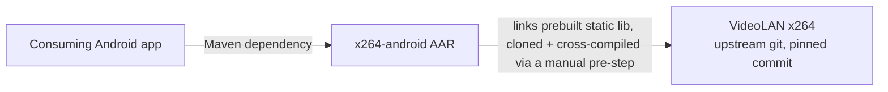
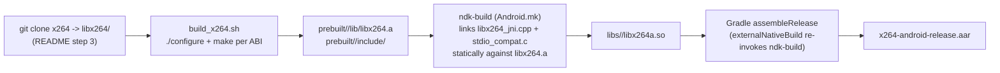

# Architecture

## Context

A consuming Android application depends on the published AAR
(`com.displaynote.x264lib:x264lib`) to encode raw camera/video frames
(YUV/NV formats) into H.264 in real time, without shipping its own copy
of x264 or writing JNI glue itself.



There is no backend, no network calls, and no persistence — this is a
pure on-device encoding library.

## Containers

```mermaid
flowchart TB
    subgraph "x264-android module"
        JavaAPI["Java API layer\nX264Encoder / X264Params /\nX264InitResult / X264EncodeResult"]
        JNI["JNI bridge\nlibx264_jni.cpp -> libx264a.so"]
        Native["Vendored native encoder\nlibx264.a (per-ABI static lib)"]
    end
    App[Consuming app] --> JavaAPI
    JavaAPI -->|"System.loadLibrary(\"x264a\")\n+ native methods"| JNI
    JNI -->|LOCAL_STATIC_LIBRARIES| Native
    Native -.->|"cross-compiled by build_x264.sh\nfrom cloned upstream source"| Upstream[VideoLAN x264 git]
```

- **Java API layer** (`x264-android/src/main/java/com/github/bakaoh/x264/`):
  thin data classes + a class with 4 `native` methods. No business logic.
- **JNI bridge** (`x264-android/src/main/cpp/libx264_jni.cpp`, plus
  `stdio_compat.c`): translates between JNI types and the x264 C API.
  Compiled by `ndk-build` per `Android.mk` into `libx264a.so`.
- **Vendored native encoder**: `libx264.a`, one static archive per ABI
  under `x264-android/src/main/cpp/prebuilt/<ABI>/lib/`, produced by
  running upstream x264's own `./configure && make` inside a freshly
  cloned `libx264/` checkout (`build_x264.sh`). Never modified in place.

## Components — encode call flow

```mermaid
sequenceDiagram
    participant App
    participant Encoder as X264Encoder (Java)
    participant JNI as libx264_jni.cpp
    participant X264 as libx264 (native)

    App->>Encoder: new X264Encoder(); initEncoder(params)
    Encoder->>JNI: initEncoder(thiz, params)
    JNI->>X264: x264_param_default_preset / x264_param_apply_profile
    JNI->>X264: x264_encoder_open
    JNI->>X264: x264_encoder_headers (SPS/PPS)
    JNI-->>Encoder: X264InitResult(err, sps, pps)
    App->>Encoder: encodeFrame(frame, csp, pts)
    Encoder->>JNI: encodeFrame(thiz, frame, csp, pts)
    JNI->>X264: x264_encoder_encode
    JNI-->>Encoder: X264EncodeResult(err, data, pts, isKey)
    App->>Encoder: releaseEncoder()
    Encoder->>JNI: releaseEncoder(thiz)
    JNI->>X264: drain delayed frames, x264_encoder_close
```

`EncoderContext` (in `libx264_jni.cpp`) holds `x264_param_t`, the
`x264_t *encoder` handle, and the reusable `x264_picture_t` — its pointer
is stashed in the Java object's private `long ctx` field via
`SetLongField`/`GetLongField`. There is exactly one encoder instance per
`X264Encoder` object; it is not thread-safe and not reentrant.

## Build-time data flow (distinct from runtime call flow)



`build_x264.sh` is a manual, one-time (per NDK/x264 pin) prerequisite —
it is not wired into the Gradle task graph. `assembleRelease` only
re-runs `ndk-build` (step D→E→F); it does not re-fetch or rebuild
`libx264.a` if the prebuilt archives are missing or stale.

## Active architectural decisions

- **Static linking, not dynamic**: `libx264.a` is linked statically into
  `libx264a.so` (`Android.mk`: `LOCAL_STATIC_LIBRARIES := libx264`,
  `PREBUILT_STATIC_LIBRARY`). This avoids runtime dependency resolution
  for the encoder but means every ABI's `.so` embeds its own full copy of
  x264 — and carries the GPL implications noted in `AGENTS.md`.
- **`ndk-build`, not CMake**: there is no `CMakeLists.txt` anywhere in the
  repo; the native build is entirely `Android.mk`/`Application.mk`-driven.
- **16 KB page-size linker flags** (`-Wl,-z,max-page-size=16384` in both
  `Android.mk` and `Application.mk`) were added to comply with Android
  15+'s page-size requirement for apps targeting new devices.
- **`APP_PLATFORM := android-21`** is the native floor. The Java-side
  SDK triple in `x264-android/build.gradle` is `minSdkVersion 26`
  (Montage product requirement), `targetSdkVersion 35`,
  `compileSdkVersion 36` — all comfortably above the native floor and a
  settled decision, not open. The remaining open risk is that root
  `build.gradle` still pins Android Gradle Plugin `7.4.2`, which predates
  official support for `compileSdk 36` — see the AGP gotcha in
  `AGENTS.md`.
